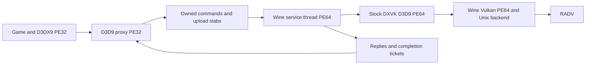

# D3D9 bridge: 32-bit client, 64-bit DXVK service

Status: design for owner review. No bridge implementation or gameplay result is
claimed. Prototype work starts only after this design is approved. The Vulkan
append/replay work remains necessary for other graphics APIs.

## Decision and evidence

Use a thin PE32 `d3d9.dll` proxy and a PE64 service inside the existing Wine
process. The service owns stock 64-bit DXVK D3D9 objects and calls them on a
Wine-managed 64-bit thread. DXVK retains its own command-stream, submission and
compiler threads. Its PE64 Vulkan calls reach the existing Wine Vulkan Unix
backend and RADV without the PE32 batching path.

A separate server process is unsuitable for the current port:
[patch 0550](../wine/patches/0550-ntdll-ps5-no-process-creation.patch) returns
`STATUS_NOT_SUPPORTED` for process creation. This proposal does not add a second
process or replace DXVK's renderer with a new native D3D9 implementation.

Sources inspected for this design:

- NVIDIA bridge-remix, commit `7dbbd371cb0bb92276f59536ef5f12b489b73550`:
  [command header](https://github.com/NVIDIAGameWorks/bridge-remix/blob/7dbbd371cb0bb92276f59536ef5f12b489b73550/src/util/util_commands.h),
  [queue and response interface](https://github.com/NVIDIAGameWorks/bridge-remix/blob/7dbbd371cb0bb92276f59536ef5f12b489b73550/src/util/util_bridgecommand.h),
  [buffer locks](https://github.com/NVIDIAGameWorks/bridge-remix/blob/7dbbd371cb0bb92276f59536ef5f12b489b73550/src/client/lockable_buffer.h),
  [queries](https://github.com/NVIDIAGameWorks/bridge-remix/blob/7dbbd371cb0bb92276f59536ef5f12b489b73550/src/client/d3d9_query.cpp),
  [server dispatch and DXVK loading](https://github.com/NVIDIAGameWorks/bridge-remix/blob/7dbbd371cb0bb92276f59536ef5f12b489b73550/src/server/main.cpp),
  [process creation](https://github.com/NVIDIAGameWorks/bridge-remix/blob/7dbbd371cb0bb92276f59536ef5f12b489b73550/src/util/util_process.cpp).
  The repository is archived; its README points to the bridge directory in
  dxvk-remix. This frozen version is a design reference, not a claim to track
  current Remix behavior.
- DXVK v2.6.2, commit `9d6f54a1ade20d1d27dd421024717a636f3d8c68`:
  [device interface](https://github.com/doitsujin/dxvk/blob/9d6f54a1ade20d1d27dd421024717a636f3d8c68/src/d3d9/d3d9_device.h),
  [device, locks and draw uploads](https://github.com/doitsujin/dxvk/blob/9d6f54a1ade20d1d27dd421024717a636f3d8c68/src/d3d9/d3d9_device.cpp),
  [query polling](https://github.com/doitsujin/dxvk/blob/9d6f54a1ade20d1d27dd421024717a636f3d8c68/src/d3d9/d3d9_query.cpp),
  [swapchain](https://github.com/doitsujin/dxvk/blob/9d6f54a1ade20d1d27dd421024717a636f3d8c68/src/d3d9/d3d9_swapchain.cpp),
  [window procedures](https://github.com/doitsujin/dxvk/blob/9d6f54a1ade20d1d27dd421024717a636f3d8c68/src/d3d9/d3d9_window.cpp).
- The project's pinned Wine `490f6d5dcbb2a5047345b8af88d114bbcaad69a8`:
  [thread setup](https://github.com/wine-mirror/wine/blob/490f6d5dcbb2a5047345b8af88d114bbcaad69a8/dlls/ntdll/unix/thread.c),
  [AMD64 thread startup](https://github.com/wine-mirror/wine/blob/490f6d5dcbb2a5047345b8af88d114bbcaad69a8/dlls/ntdll/unix/signal_x86_64.c),
  [loader initialization](https://github.com/wine-mirror/wine/blob/490f6d5dcbb2a5047345b8af88d114bbcaad69a8/dlls/ntdll/loader.c).

Remix establishes the client/server pattern, local object proxies, shared upload
storage and reply commands. Its optional response macros can return success
without the server's HRESULT. We will not copy that choice indiscriminately.
The server explicitly supports loading a vanilla 64-bit DXVK DLL. Its ordinary
process bootstrap cannot be reused on this port.

## Bootstrap is the first technical gate

Loading an arbitrary PE64 DLL from a PE32 DLL is not a supported shortcut. The
existing 64-bit WoW64 dispatcher provides a place to add a private bootstrap,
but a raw pthread cannot safely call DXVK's Windows imports.

Introduce a narrow Wine extension that creates a native PE64 service domain:

1. Enter from a private WoW64 service while the correct host state is active.
   Create a Wine-managed thread with a native stack, TEB64, loader registration,
   exception state and CRT TLS. Load the bridge service through the native loader.
2. Explicitly distinguish this thread and its descendants from ordinary guest
   threads. Current Wine startup prepares an I386 context for WoW64 threads and
   routes loader initialization through `Wow64LdrpInitialize`; merely passing a
   64-bit entry address to `CreateThread` does not prove native-only execution.
3. Ensure DXVK-created worker threads inherit the native domain. Preserve normal
   PE32 startup, thread attach/detach, shutdown, exception and wait behavior for
   the game. Do not globally disable WoW64 or borrow another thread's TEB.
4. Load the exact PE64 D3D9 backend by an explicit private path, resolve
   `Direct3DCreate9`/`Direct3DCreate9Ex`, and complete a versioned handshake before
   returning the first proxy. Audit its PE64 import closure, including Wine
   user32/gdi32/kernelbase dependencies; the current WoW64 bootstrap alone does
   not prove those libraries can initialize together.
5. On bootstrap failure, return the appropriate D3D creation failure. A profile
   can select the previous backend on the next launch. Never switch a live
   device between implementations.

Required proof before game work: a PE32 synthetic client loads the PE64 backend,
creates/releases a D3D9 interface, exercises allocations above 4 GiB, starts a
backend child thread, uses TLS and exceptions, and exits repeatedly without
entering guest32 execution on service threads. First prove on host Wine, then
on the console through the designated runner. Failure keeps B1 incomplete;
it does not justify silently substituting 32-bit DXVK.

## Wire protocol and ordering

Use an independent D3D9 protocol over the bounded SPSC arena infrastructure from
the Vulkan work. Share framing and ownership primitives, not Vulkan opcodes or
the process-wide Vulkan replay lock. The first version has one service consumer
per D3D9 device; D3D9 state changes are ordered on that device.

Each little-endian record has a fixed-width header: magic/version, opcode,
flags, total byte count, device ID, object ID plus generation, 64-bit sequence,
and reply ticket. Payloads contain scalar values, object IDs and checked
(offset,length) slices. No COM pointers, native `size_t`, C++ layouts, HWND
pointers, guest callback pointers or borrowed arrays are wire representations.
Define each payload field explicitly and test both 32-bit and 64-bit decoders.

Use one producer arena per calling thread and an atomic device sequence.
Publishing a record is a release operation; consumption is acquire. Reservation
must expose an in-flight sequence, so a later published record cannot overtake
an earlier unpublished reservation. The service advances only through a
contiguous committed prefix. Arena storage is reusable only after consumption
acknowledges that prefix. A failed/abandoned reservation cancels the session;
never wait forever for an invisible hole.

Queue space and low-address upload storage are bounded. Full queues wait for
consumption with a session failure check. Wake the service on empty-to-nonempty
transitions; do not make a Unix call for every state setter. Publish at explicit
flush boundaries and bounded arena occupancy/latency. Synchronous requests flush
all earlier commands for that device, then wait for their own reply ticket.
Replies include ticket, sequence, HRESULT, result length and owned result data.
Reject stale, duplicate, out-of-range and wrong-generation replies.

With `D3DCREATE_MULTITHREADED`, serialize the guest-visible device state and
sequence reservation as a single API transaction. Without it, preserve D3D9's
calling contract; do not invent ordering across illegal concurrent callers.
Device-independent module queries use a separate initialization queue.

## Method policy and errors

Many D3D9 setters and draws return HRESULT even though they have no output data.
A generated interface inventory must assign every method a validation, ordering,
output and lifetime policy before enabling it. Unknown methods are explicit
unsupported operations or synchronous implementations, never success stubs.

| Method family | Client/service policy |
| --- | --- |
| Factory, caps and format queries; resource/shader/query/swapchain creation | Synchronous; return exact HRESULT and outputs. Cache immutable results only after success. |
| State setters, constant uploads, stream/index/shader bindings, draw calls | Queue only when client validation proves the immediate result for the pinned backend. Copy all data and retain object references. Otherwise use a synchronous reply. |
| State getters and resource descriptions | Serve a fully modeled local shadow, including AddRef semantics, or synchronously query the service. State blocks and Reset must update that shadow coherently. |
| `GetData`, readback, read locks, `TestCooperativeLevel`, Reset/ResetEx | Synchronous command completion. A query poll returning `S_FALSE` stays a poll; do not wait for GPU completion or turn FLUSH into an unbounded wait. |
| Present/PresentEx | Return backend HRESULT and pacing outcome after prior commands reach the service. Completion is not necessarily GPU completion. Honor flags and the negotiated maximum frame latency. |
| AddRef/Release, QueryInterface, GetDevice and GetContainer | Maintain COM identity locally; service destruction is ordered after the last queued reference. Unsupported interfaces return `E_NOINTERFACE`. |
| State-block capture/apply, resource copies and scene boundaries | Explicit ordered records; shadow changes and retained references follow the same order. Synchronous where immediate results cannot be established locally. |

Backend failures discovered after an accepted asynchronous command set a sticky
session/device failure and wake all waiters. Expose failure at the next applicable
synchronous boundary; record the failing sequence. Do not convert device loss to
success. The implementation review must prove that moving a method to the queued
set does not hide an immediate API error. Start with synchronous coverage where
that proof is missing, then optimize measured hot methods; a fully synchronous
forwarder alone is not the requested finished bridge.

## COM objects and resource lifetime

Client proxies use a stable ID table with a generation counter and canonical
IUnknown identity. Service entries hold the real PE64 interfaces. Returned
subresources reuse an existing proxy when appropriate, retain their container,
and implement private data without transporting arbitrary guest pointers.
IUnknown-valued private data stays in the client identity model.

Guest reference counts and queued references are distinct. Releasing the final
guest reference prevents further API use but cannot free a service object still
named by queued records. Send ordered destruction after those records; a recycled
slot receives a new generation. Handle creation failure, partial multi-object
results and device teardown without exposing uninitialized IDs. Shutdown stops
new producers, drains or cancels outstanding work, releases service objects,
joins service threads, and only then unloads backend modules.

## Lock/Unlock and transient uploads

All pointers returned to the PE32 game must fit below 4 GiB. Shared upload slabs
are the limited exception to moving backend memory out of that range. DXVK's
heaps, shaders, command storage and mappings may live above 4 GiB; never truncate
a service pointer to satisfy a client lock.

For buffers, encode resource ID, byte range, flags and a storage generation.
Zero-size locks, DISCARD/NOOVERWRITE combinations, pool rules and DONOTWAIT must
match the pinned DXVK behavior, not assumptions about similarly named flags.
Validate bounds and overflow before touching shared memory.

- Writable dynamic DISCARD can allocate a fresh bounded client slab. NOOVERWRITE
  uses an appropriate range of the current generation. The game writes there;
  Unlock publishes an immutable range, and the service performs the real backend
  Lock/copy/Unlock in command order. Keep old generations until their queued
  users have consumed them. Never let a later guest write change an earlier draw.
- The initial implementation acknowledges backend Lock/Unlock results where
  they can fail. Removing that round trip from a hot write path requires an
  explicit error-semantics and lifetime proof, including allocation failure and
  device loss. Measure the stall cost; do not declare B1 finished if dynamic
  locks erase the intended gain.
- Read-only/read-modify-write locks first complete the required service work,
  copy data into low-address staging and return the actual pitch/range. Texture
  and volume locks handle rows, slices, block-compressed formats and subrects;
  no assumption of tightly packed memory. Return only after data is ready.
- Managed/system-memory resources maintain the minimum client shadow required
  by CPU access and reset semantics. Dirty rectangles/ranges drive uploads.
  Measure this low-address footprint; the bridge does not eliminate all 32-bit
  resource memory.
- DrawPrimitiveUP/DrawIndexedPrimitiveUP, shader bytecode, declarations, constants,
  palettes and region data are copied before returning. Check counts, strides,
  index width and arithmetic; no pointer survives into asynchronous replay.

GTA IV's frequent dynamic VB/IB locks are a dedicated benchmark. Keep upload
bytes, copies, slab occupancy, reuse waits and per-method synchronous wait time.

## Windows, input, presentation and D3D9Ex

Use a service-owned PE64 presentation window paired with the original guest
window through a narrow Wine driver association. DXVK can subclass its own
64-bit window. Do not install its 64-bit WNDPROC into a guest32 window: the
inspected DXVK window code replaces GWLP_WNDPROC and calls the previous procedure.
Cross-architecture callbacks here require more than converting a handle.

The guest window remains the input/message owner. Mirror size, focus, visibility,
fullscreen and destruction into the service presentation state through explicit
messages, preserving order around CreateDevice, Reset and Present. Translate
presentation HWND parameters and returned creation parameters through the
association; keep the guest-visible handle unchanged. The driver must give the
pair one display-plane owner and must not let a hidden probe window acquire it.

Synchronous waits that can trigger window messages use a dedicated callback
channel serviced on the owning guest thread with a bounded reentrancy policy.
No server-to-client callback while holding a producer/device/registry lock.
Prove focus changes, cursor coordinates, input, window destruction, reset and
normal close with a synthetic UI test before game deployment. This window
association and the native thread domain are the two largest unproven platform
changes in the proposal.

Expose D3D9Ex only when its factory, interface identity, PresentEx/ResetEx,
latency, device-state and resource behavior are implemented. B1 may initially
select a D3D9-only profile, but must record Ex requests and fail them correctly;
B2 cannot silently pretend to provide Ex. Preserve presentation interval and
flags; the service must not add an unconditional GPU-idle wait per frame.

## Build, caches and compatibility

Build the client for PE32 and the service for PE64. Pin both to the same wire
schema and package manifest. Build the PE64 DXVK backend from the exact source
and accepted compatibility patch set used by the comparison baseline; the source
version inspected above is a reference, not proof of the currently installed
game DLL's identity. Record commit, patches and hashes before a comparison.
Use explicit backend paths to prevent the service from recursively loading the
client proxy. Preserve licenses when packaging or adapting upstream code.

Use stock DXVK shader/pipeline cache behavior on the service side. Keep cache
paths tied to game, backend identity and relevant configuration; retain the same
compiler-thread budget. Compare cold with cold and warm with warm. Do not assume
32-bit/64-bit cache compatibility without checking the backend's format/key.
D3DX9 and game mods remain on the client initially; all calls they issue must pass
through the proxy's complete interface and state model.

Keep the existing D3D9 backend selectable per profile. No in-session fallback
once the first bridged object exists. Zink, Vulkan and other D3D versions keep the
Vulkan replay implementation. Extension to D3D8/10/11 is outside B1/B2 and needs
separate evidence.

## Delivery and acceptance after owner review

1. Native PE64 service domain and import/TLS/child-thread proof; no game proxy yet.
2. Validated transport, object identity and bounded ownership tests, including
   malformed input, queue-full cancellation, destruction and reply races.
3. Module/device and presentation-window association, with exact synthetic
   results for callbacks, reset, failure and normal teardown.
4. Resources, locks, shaders, states, draws and queries. Differential host tests
   compare outputs, HRESULTs and rendered images against the same DXVK backend.
   Generate an interface coverage manifest; a game smoke pass is not completeness.
5. GTA SA prototype with all required mods and Proper Shaders medium, matched
   moving route against the completed Vulkan replay baseline. Capture mean and
   5%-low FPS, render/main-thread splits, HUD load, queue occupancy, synchronous
   waits, copied bytes and low-address memory usage. Keep diagnostic and final
   uninstrumented performance runs separate.
6. GTA IV and HL2, including dynamic-buffer behavior, loading, saves, queries,
   readback, resets and teardown. Accept only measured improvement without the
   specified regressions; preserve exact packages and restoration evidence.

Split implementation into small dependency-ordered PRs with host tests, targeted
builds, applicable console evidence and green CI. Do not claim that stock PE64
loading, extra threads or higher address space alone proves a performance gain.

Owner review requested: approve the in-process PE64 service architecture and its
bootstrap/window proof gates before B1. If those gates fail, return with evidence
and an amended design; do not silently switch to a separate process, a custom
D3D9 renderer or a 32-bit backend.
